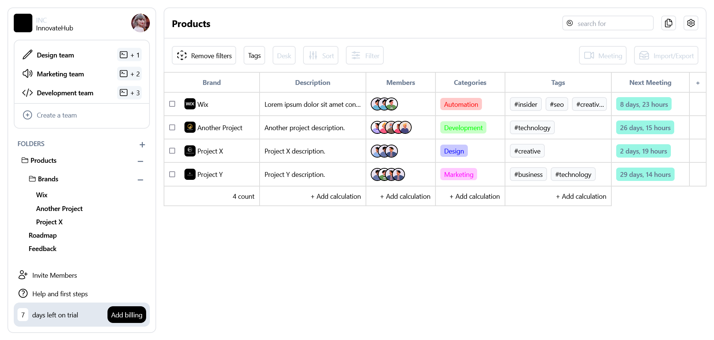

# K RITE



### Description

I have tried to replicate as much as possible to make it look exact look-alike of the original UI. Following are some of the feature that are implemented in this assessment - 
* UI is responsive
* filtering by tags
* searching by brand name
* selecting single/multiple brand/s and deleting
* folder structure in sidebar, including nested folders

### Tech Stack & External Packages
* React
* Tailwind css
* Hero Icons

## Installation
Step I - clone this repository
```
gh repo clone dnyaneshwar411/K_Rite
```

Step II - move to the root directory of the project if not already at the location.

Step III - install node modules
```
npm install
```

Step IV - start the local server
```
npm run dev
```

<br/>
You can check out the repo at this link - <a href="https://youtube.com"><strong>K-Rite</strong></a>

<br/>
I hope to hear from you soon contact me

* Phone - <a href="tel:9067183889"><strong>9067183889</strong></a>
* Mail - <a href="mailto: dnyaneshwarpk20@gmail.com"><strong>dnyaneshwarpk20@gmail.com</strong></a>